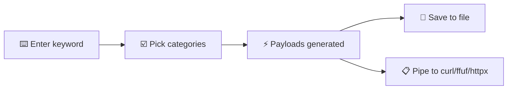

<div align="center">

# 🔓 bypass403

**Generate path-based 403/401 bypass payloads from a single keyword.**
A single-file CLI helper for pentesters and bug bounty hunters.


<br>

<!-- Replace with a screenshot of the tool -->


[How it works](#-how-it-works) · [Features](#-features) · [Usage](#-usage) · [Flags](#-flags) · [Categories](#-categories) · [Responsible use](#%EF%B8%8F-responsible-use)

</div>

---

## 💡 What is it?

Testing a 403 for bypasses means trying the same handful of path tricks over and over. **bypass403** builds that list for you.

Give it a keyword like `admin`, and it generates path-only payloads — slash tricks, case variation, extension appending, encoding, Tomcat quirks and more — ready to feed into `curl`, `ffuf`, `httpx`, or any HTTP client.

It only generates payloads. It doesn't send any requests itself.

## ⚙️ How it works



## ✨ Features

| | |
|---|---|
| 🗂️ **15 bypass categories** | Slashes, case, encoding, unicode homoglyphs, overlong UTF-8, Tomcat tricks and more. |
| 🧩 **Custom templates** | Add your own payload shapes with `--custom`, using `{w}` as the keyword placeholder. Repeatable. |
| 🧵 **Extension appending** | Append common extensions like `json`, `php`, `html` with `--ext`. |
| 🔗 **Base URL prefixing** | Prepend a target URL with `--base-url` so payloads are ready to run. |
| 💾 **Save to file** | Write the full payload list with `-o` for feeding into `ffuf` or `httpx`. |
| 📦 **Zero dependencies** | Pure Python standard library. Nothing to install. |

---

## 🚀 Usage

```
$ python3 bypass403.py admin
$ python3 bypass403.py admin --base-url https://target.com
$ python3 bypass403.py admin --categories slashes,encoding
$ python3 bypass403.py admin --custom "{w}//\..//\"
$ python3 bypass403.py admin --ext json,php,html
$ python3 bypass403.py admin -o payloads.txt
```

To display the help for the tool:

```
$ python3 bypass403.py -h
```

> 💡 All generated payloads are path-only techniques. No headers (`X-Original-URL`, `X-Forwarded-For`, etc.) or HTTP methods are generated, since those aren't part of the URL itself.

**Installation:**

```
$ git clone https://github.com/moh3n355/bypass403.git
$ cd bypass403
$ python3 bypass403.py -h
```

---

## 🚩 Flags

| Flag | Description | Example |
|---|---|---|
| `--base-url` | Prefix every generated payload with this base URL | `bypass403.py admin --base-url https://target.com` |
| `--categories` | Comma-separated list of categories to generate (default: all) | `bypass403.py admin --categories slashes,tomcat` |
| `--ext` | Comma-separated list of extensions used by the `extension` category (default: `json,css,php,html,xml,txt`) | `bypass403.py admin --ext json,php` |
| `--custom` | Custom payload template using `{w}` as the keyword placeholder. Repeatable. | `bypass403.py admin --custom "{w}//\..//\"` |
| `-o`, `--output` | Save the generated payloads to a file | `bypass403.py admin -o payloads.txt` |
| `-h`, `--help` | Show help and exit | `bypass403.py -h` |

---

## 🗂️ Categories

### Structure

| Category | What it covers |
|---|---|
| `slashes` | `/admin/`, `//admin/`, `/admin//`, `///admin`, `/admin/.`, `/./admin/./`, `/admin/..;/` |
| `case` | `/ADMIN`, `/admin`, `/AdMiN` (alternating case) |
| `extension` | `/admin.json`, `/admin.php`, `/admin.html`, ... (see `--ext`) |
| `suffix` | `/admin#`, `/admin?`, `/admin?foo=bar`, `/admin?debug=true` |

### Encoding

| Category | What it covers |
|---|---|
| `nullbyte` | `/admin%00`, `/admin%0d%0a` |
| `whitespace` | `/admin%20/`, `/admin%09/` |
| `encoding` | Full URL-encoded word, single-character-encoded variants |
| `doubleencoding` | Double URL-encoded variants (`%2569` style) |
| `unicode` | Fullwidth unicode homoglyph version of the word |
| `overlong` | Overlong UTF-8 encoded slash variants (`%c0%af`, `%c1%9c`, ...) |
| `dotencode` | `/admin%2e/`, `/admin%2e%2e/` |
| `backslash` | `/admin%5c`, `/admin\`, `\admin` |
| `doublespace` | `/admin%2520` |

### Server-specific

| Category | What it covers |
|---|---|
| `tomcat` | `/admin;.json`, `/admin;/`, `/admin.;/` |
| `redirect` | `/admin?redirect=%2fadmin`, `/admin?path=..%2f..%2fadmin` |

---

## ⚖️ Responsible use

This tool is for authorized security testing only. Only run it against targets you own or have explicit permission to test, and stay within the scope of the engagement or program you're working under.

<div align="center">
<sub>Built for testers who've seen one too many 403s. 🔓</sub>
</div>
